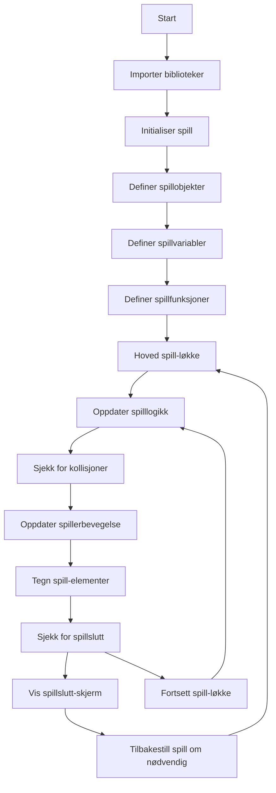

# Mario Bros - Spill

## Om spillet
- Dette er en kort beskrivelse av spillet, inkludert funksjoner, hvordan du spiller det, og andre relevante detaljer.
- Spillet er basert på Super Mario av Nintendo.
- NB: Markdown dokumenter leses i VS-code ved å høyreklikke på filen og velge "open Preview". Annbefaler denne: "Markdown Preview Mermaid Support".

## Kjente problemer
...

## Spillets opbyggning
Under er et forenklet flytdiagram som viser logikken i programmet.

## Installering og kjøring

For å kjøre spillet, følg disse trinnene:

1. Sørg for at du har Python installert på datamaskinen din. Du kan laste ned Python fra [den offisielle nettsiden](https://www.python.org/downloads/).

2. Installer Pygame-biblioteket ved å kjøre følgende kommando i terminalen eller kommandolinjen: pip install pygame

3. Last ned spillets kildekode fra dette repositoryet.

4. Naviger til mappen der du har lastet ned kildekoden.

5. Kjør spillet ved å kjøre hovedfilen `spill.py`:

## Spillkontroller

- **Venstre piltast:** Beveg Mario mot venstre.
- **Høyre piltast:** Beveg Mario mot høyre.
- **Opp-piltast:** Få Mario til å hoppe.
- **Museklikk:** Brukes til å navigere i startmenyen og registrere navn når spillet er ferdig.

## Spillets mål

Målet med spillet er å hjelpe Mario med å overvinne hindringer, samle mynter og fullføre banen på kortest mulig tid. Pass på å unngå fiender og fallgruver for å øke sjansene for å nå målstreken.

## Spillfunksjoner

- **Poengtavle:** Hold oversikt over poengsummen din og de beste resultatene på poengtavlen.
- **Registrering av data:** Spillet lar deg registrere navnet ditt og lagre poengsummen og tiden din etter at du har fullført en bane.

## Forfatter

Dette spillet ble utviklet av Torbjørn og Martin.